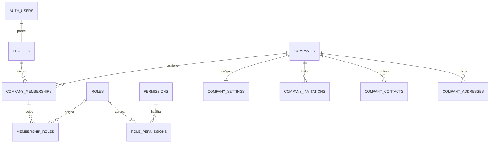

# Modelo de datos — Etapa 1

La Etapa 1 introduce perfiles vinculados a `auth.users`, empresas multi-tipo, membresías, RBAC, invitaciones, contactos, direcciones, preferencias y auditoría ampliada.

La autorización se aplica en PostgreSQL mediante RLS. Los filtros del frontend nunca constituyen una frontera de seguridad.
